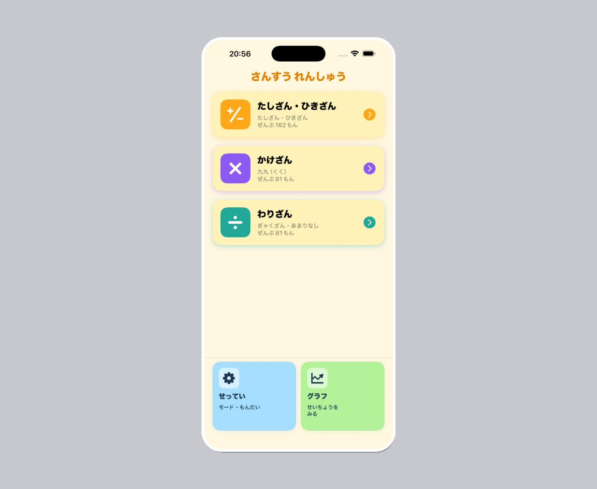
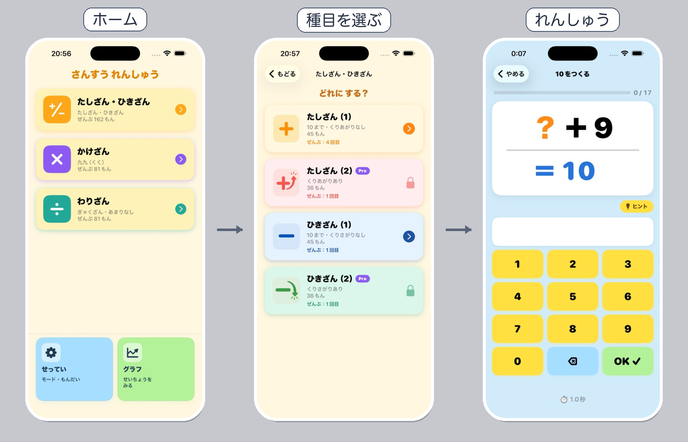
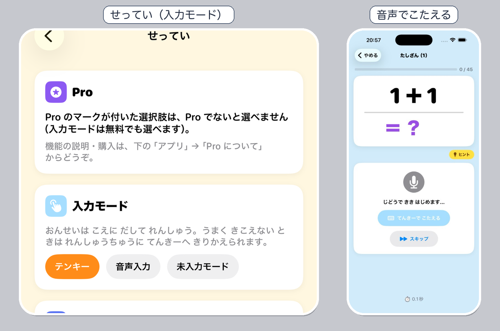
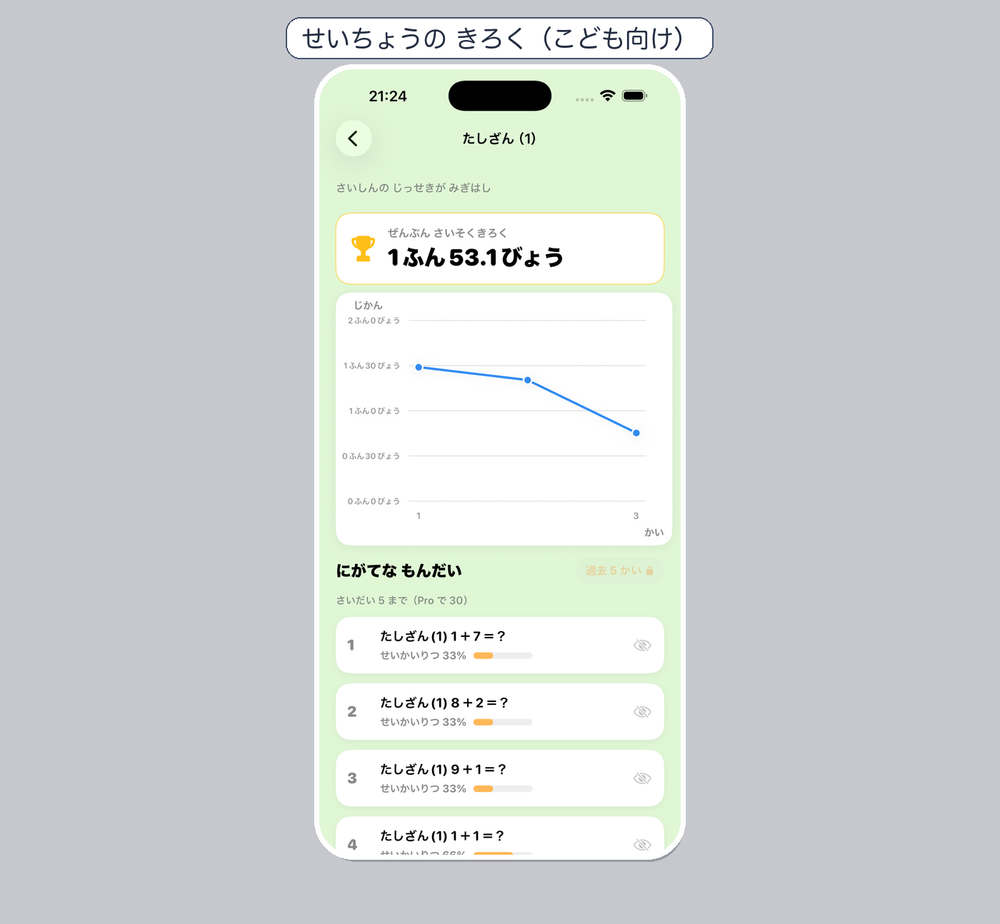

# 毎日 計算れんしゅう — 保護者向けガイド

小学校低学年のお子さま向けの、計算れんしゅうアプリです。

| 場所 | 表示名 |
|------|--------|
| App Store | **毎日 計算れんしゅう** |
| ホーム画面 | **算数練習** |
| アプリ内 | **さんすう れんしゅう** |

このページでは、**おうちの方に「何ができるアプリか」**が伝わるよう、機能の全体像から操作の流れまでをまとめています。

  

## 目次

1. [このアプリでできること](#このアプリでできることひと目で)
2. [練習の流れ](#練習の流れ)
3. [ホーム画面の見かた](#ホーム画面の見かた)
4. [練習メニュー一覧](#練習メニュー一覧)
5. [答え方・ヒント・おしらせ](#答え方ヒントおしらせ)
6. [記録の見かた（子ども向け / 保護者向け）](#記録の見かた子ども向け--保護者向け)
7. [せってい一覧](#せってい一覧)
8. [無料と Pro のちがい](#無料と-pro-のちがい要約)
9. [アプリを入れる](#アプリを入れる)
10. [困ったとき](#困ったとき)

---

## このアプリでできること（ひと目で）

| できること | 内容 |
|------------|------|
| **毎日の計算れんしゅう** | たしざん・ひきざんから、たんい（ながさ・かさ・とけい）まで |
| **答え方を選べる** | テンキー / 声に出す / こたえを見るだけ |
| **ヒント** | つまずいたとき、計算のしかたを画面で確認 |
| **記録が残る** | 正答率・にがて・成長のグラフ（**お子さま向け**） |
| **習慣づくり** | 連続日数・毎日のおしらせ（リマインダー） |
| **保護者向けまとめ** | **練習のまとめ**で直近の練習回数や正答率を確認 |
| **復習の工夫（Pro）** | 弱点優先の出題、練習後のまちがい復習、出題数の指定など |

無料でも毎日の基礎練習ができます。くりあがり・九九・ひっさんなど学年が進む内容や、復習を効率化したいときは **算数練習 Pro** があります（課金は **せってい** → **おうちの方へ** から）。

---

## 練習の流れ

  

1. アプリを開く → **ホーム**
2. 大きなメニューを選ぶ（例: **たしざん・ひきざん** / **たんい**）
3. 種目を選ぶ（例: **たしざん（1）**、**とけい（1）**）
4. 問題に答える → **OK**（とけい・ひっさんなどは画面の案内に従う）
5. 全問終わると **練習完了**（その回の記録が残ります）

### 途中でやめるとき

| 操作 | 結果 |
|------|------|
| **やめる** → **いちじちゅうだん** | 途中まで保存。ホームの **つづきから** で再開 |
| **やめる** → **ほんとうに やめる** | その回は保存されない |

練習中に答えにくいときは **スキップ** できます（その問題は後回し／未解答扱い。種目やモードにより表示されます）。

---

## ホーム画面の見かた

ホームは次の **4つの練習メニュー** が中心です。

| メニュー | 中身の例 |
|----------|----------|
| **たしざん・ひきざん** | たしざん（1）（2）、10をつくる／使う、ひっさん など |
| **かけざん** | 九九（1〜9のだん）※Pro |
| **わりざん** | 九九の逆算・あまりなし ※Pro |
| **たんい** | ながさ・かさ・とけい |

そのほかによく見る表示:

| 表示 | 意味 |
|------|------|
| **れんぞく ○ にち** | 続けて練習した日数（ストリーク） |
| **つづきから** | 中断した練習を再開（あるときだけ） |
| **せってい** | 入力方法・ヒント・出題のしかた・**おうちの方へ** |
| **グラフ** | **せいちょうの きろく**（お子さまが自分の記録を見る） |

---

## 練習メニュー一覧

### 無料ですぐ始められる種目

| 種目 | どんな練習か |
|------|----------------|
| たしざん（1） | 答えが 10 までの足し算 |
| ひきざん（1） | 答えが 10 までの引き算 |
| **10をつくる** | 例: `3 + ? = 10`（10 になる数を答える） |
| **10を使う** | 例: `10 − 7`（10 から引く） |
| **ながさ（1）** | cm・mm、同じ単位のたし算・ひき算 |
| **かさ（1）** | L・dL・mL、同じ単位のたし算・ひき算 |
| **とけい（1）** | とけいを見て、なんじ・なんぷんを答える |

鍵マークの種目は **算数練習 Pro** が必要です。

### Pro で広がる種目

| 種目 | 内容 |
|------|------|
| たしざん（2）・ひきざん（2） | くりあがり・くりさがり |
| たしざん／ひきざん **ひっさん** | たてに書いてけいさん（桁ごと入力） |
| かけざん（1〜9のだん） | 九九 |
| わりざん（1〜9のだん） | 九九の逆算・あまりなし |
| ながさ（2）・かさ（2）・とけい（2） | たんいの応用 |

### たんい・とけい・ひっさんの答え方

答えは **数字だけ** を入れます（たんい）。cm や L などの単位は、問題と答えの横に表示されます。

| 種目 | できること |
|------|------------|
| ながさ（1） | cm と mm、同じ単位のたし算・ひき算 |
| ながさ（2） | m、異なる単位をそろえる計算 ※Pro |
| かさ（1） | L・dL・mL、同じ単位のたし算・ひき算 |
| かさ（2） | 異なる単位をそろえる計算 ※Pro |
| とけい（1） | とけいを見て、じ・ふんを答える |
| とけい（2） | じかんとふん、かかったじかん ※Pro |

**とけい（1）** … `□じ □ふん` の順にテンキーで入れます。**12じせい（例: 3じ）でも 24じせい（例: 15じ）でも、針が同じ位置なら正解**です。音声モードでもテンキーに切り替わります（開始前に案内あり）。時間ははかりません（正答率・にがては記録）。

**ひっさん** … いちのくらいから桁ごとに入力。くりあがり／くりさがりの書き込みますは任意（採点しません）。音声入力には対応していません。

---

## 答え方・ヒント・おしらせ

  

### 答え方（**せってい** → **入力モード**・無料）

| 入力 | 使い方 |
|------|--------|
| **テンキー** | 数字を押して **OK** |
| **音声** | こたえを声に出す（初回はマイク許可が必要）。認識できたら自動で進みます |
| **未入力** | 答えを入れず、正解だけ確認する |

うまく聞き取れないときは、練習画面の **てんきーで こたえる** からテンキーに切り替えられます。  
※ **とけい（1）**・**ひっさん** は音声非対応のため、テンキーを使います。

### ヒント（無料）

- 出題画面の **ヒント** で、計算のしかたを見られます（種目に合わせた段階表示）
- **せってい** → **ヒントボタン** で表示のオン／オフ
- ヒントを開いているあいだは答えられず、タイマーも止まります。**とじる** で戻ります

### 毎日のおしらせ（リマインダー）

**せってい** → **れんしゅうのじかん**

1. 「**する**」→ おしらせの許可 → 時刻を選ぶ → 「**けってい**」
2. あとから「**かえる**」で時刻変更、「**しない**」で停止できます

おしらせは端末の中だけで動き、朝から夜まで好きな時刻を選べます。

### 練習が終わったあと

- **きょう ○ かいめ** … その日に何回目の完了か
- 速さの記録が出ることがあります（とけい（1）は時間をはかりません）
- Pro で **れんしゅう後の復習** をオンにしている場合、まちがえた問題だけもう一度出ます（復習の結果は記録に残りません）

---

## 記録の見かた（子ども向け / 保護者向け）

| 機能 | だれ向け | 開き方 |
|------|----------|--------|
| **せいちょうの きろく** | **お子さま** | ホームの **グラフ** |
| **練習のまとめ** | **おうちの方** | **せってい** → **おうちの方へ** → **練習のまとめ** |

### せいちょうの きろく（お子さま向け）

ホームの **グラフ** から開きます。お子さまが自分の練習の推移や「にがて」を見るための画面です。

  

1. 練習メニューを選ぶ（ホームと同じ階層）
2. 種目を選ぶ
3. **グラフ** と **にがて** を確認

| ポイント | 説明 |
|----------|------|
| グラフの1点 | その種目を一通り終えた **1回** |
| 表示 | 一度に **15回分**。古いは **左右スワイプ** |
| 実施中 | 途中でやめた分は右端に参考表示 |
| にがて | よく間違える問題の傾向（無料は直近 **5回**・最大 **5問**。Pro では範囲・件数を広げられます） |
| とけい（1） | 時間グラフ・最速記録はなし。正答率とにがては確認可 |

### 練習のまとめ（保護者向け）

**せってい** → **おうちの方へ** → **練習のまとめ** から開きます。おうちの方が、お子さまの練習回数や正答率を一覧で確認するための画面です（お子さま向けの「せいちょうの きろく」とは別です）。

| プラン | できること |
|--------|------------|
| **無料** | 直近7日間の練習回数・正答率など。日付タップで詳細 |
| **Pro** | 月カレンダーで確認（左スワイプで前の月） |

---

## せってい一覧

ホームの **せってい** から開けます。主な項目は次のとおりです。

### お子さまの練習に関する設定

| 項目 | 内容 | 無料 | Pro |
|------|------|:----:|:---:|
| **入力モード** | テンキー / 音声 / 未入力 | ○ | ○ |
| **ヒントボタン** | 出題中にヒントを出すか | ○ | ○ |
| **タイム表示** | 練習中・結果の経過時間を出すか。気になるときは「ださない」 | ○ | ○ |
| **れんしゅうのじかん** | 毎日のおしらせ（リマインダー） | ○ | ○ |
| **出題順** | **順番**（昇順）／**ランダム（にがて優先）** | 順番のみ | ランダム可 |
| **出題数** | **すべて**／5・10・15…問 | すべてのみ | 指定可 |
| **れんしゅう後の復習** | まちがえた問題だけ、正解するまで再出題（記録に残さない） | — | ○ |
| **こたえ表示時間** | 正誤のあと、正解を見せる秒数 | 1.5秒固定 | 0.5〜3.0秒 |
| **履歴件数** | 残す練習記録の件数 | 30件固定 | 50／100／無制限など |
| **にがての範囲** | 「にがて」を集計する直近回数 | 5回固定 | 5〜50回から選択 |

### 問題リスト（もんだいのしゅるい）

種目ごとの問題一覧を確認できます。

| 操作 | 無料 | Pro |
|------|:----:|:---:|
| 一覧の閲覧 | ○ | ○ |
| 四則演算の追加・削除・初期状態に戻す | — | ○ |
| たんい・とけいの問題の編集・初期状態に戻す | — | ○（編集するとその問題の成績は引き継ぎません） |

### おうちの方へ

| メニュー | 内容 |
|----------|------|
| **使い方ガイド** | このページ（できること・操作の説明）。外部ブラウザで開きます |
| **練習のまとめ** | 保護者向けの週間／月間の確認（上記） |
| **Pro について** | Pro の説明・購入・**購入を復元する**・プロモコードの引き換え |

### データのリセット

**せってい** 内の操作で、練習履歴・統計・進捗・途中の下書きをまとめて消せます。問題の一覧そのものと、入力モードなどの設定は残ります。

---

## 無料と Pro のちがい（要約）

| 内容 | 無料 | Pro |
|------|------|-----|
| 基礎のたしざん・ひきざん・10をつくる／使う | ○ | ○ |
| ながさ（1）・かさ（1）・とけい（1） | ○ | ○ |
| テンキー・音声・未入力、ヒント、タイム表示、リマインダー | ○ | ○ |
| せいちょうの きろく／練習のまとめ | ○ | ○（まとめのカレンダー・にがての深さは Pro で拡張） |
| 1日に完了できる練習 | **3回まで** | 上限なし |
| 残る練習履歴 | **30件まで** | 件数を選べる |
| くりあがり・九九・わりざん・ひっさん・たんい（2） | — | ○ |
| 出題数の指定・弱点優先ランダム・まちがい復習・こたえ表示時間の調整 | — | ○ |
| 問題リストの編集 | 閲覧のみ | 追加・削除・編集・リセット |

3回に達すると **きょうの じょうげん** と表示され、その日は新しい練習を完了して保存できません。

データは原則として **お使いの端末内** に保存されます。くわしくは [プライバシーポリシー](privacy-policy.md) をご覧ください。

---

## アプリを入れる

**ストアで開く:** [毎日 計算れんしゅう（App Store）](https://apps.apple.com/app/毎日-計算れんしゅう/id6775496517)

  

1. iPhone / iPad のカメラで QR を写す → 表示されたリンクをタップ  
2. App Store で **入手**（または **再ダウンロード**）をタップ

---

## 困ったとき

| 状況 | 対処 |
|------|------|
| 音声が聞き取られない | 練習画面で **てんきーで こたえる**、または **せってい** → 入力モードをテンキーに |
| 記録を消したい | **せってい** 内のリセット |
| Pro を買ったのに使えない | **おうちの方へ** → **Pro について** → **購入を復元する** |
| プロモコードがある | **Pro について** から引き換え |
| 時間表示が気になる | **せってい** → **タイム表示** を「ださない」に |

その他の質問は [サポート](support.md) をご覧ください。

---
