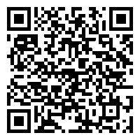

# 算数練習 — 使い方ガイド

**最終更新日:** 2026年6月23日（バージョン 1.3.0 向け）

---

本ページは、iOS アプリ **算数練習**（App Store 表示名: **毎日 計算れんしゅう**）の使い方と機能の説明です。**保護者の方**向けにまとめています。お子さまの操作は、横についてサポートしてください。

---

## アプリの入手（App Store）

**iPhone / iPad** にインストールするには、下のリンクまたは QR コードから App Store を開いてください。

**ストアで開く:** [毎日 計算れんしゅう（App Store）](https://apps.apple.com/app/毎日-計算れんしゅう/id6775496517)

<p align="left">
  
</p>

※QR は画面幅に関係なく **最大 160px** で表示されます（読み取りには十分な大きさです）。

**QR の読み取り方（iPhone / iPad）**

1. 内蔵カメラで QR を写す → 表示された通知をタップ  
   または **コントロールセンター** のコードリーダーを使う  
2. App Store が開いたら **入手**（または **再ダウンロード**）をタップ  
3. 保護者の方の Apple ID でインストールしてください

**URL（共有用）**

```text
https://apps.apple.com/app/毎日-計算れんしゅう/id6775496517
```

※アプリ本体は無料です。算数練習 Pro はアプリ内の自動更新サブスクリプション（任意）です。

---

## このアプリでできること

小学校低学年向けの、たしざん・ひきざんなどの**計算ドリル**です。

- 大きな数字とシンプルなボタンで、毎日の反復練習に向いています
- 練習データは**端末内だけ**に保存されます（アカウント登録なし）
- **オフライン**でも練習できます

| 名称 | 表示される場所 |
|------|----------------|
| 毎日 計算れんしゅう | App Store |
| 算数練習 | 端末のホーム画面 |
| さんすう れんしゅう | アプリ内のタイトル |

---

## 1. はじめかた（練習までの流れ）

1. アプリを起動すると **ホーム** が開きます
2. 練習したいメニュー（例: **たしざん・ひきざん**）をタップします
3. 種目カード（例: **たしざん（1）**、**10をつくる**）を選びます
4. 出題が始まります。テンキーなどで答えて **OK** を押します
5. 全問終了すると **練習完了** 画面が表示され、記録が保存されます

**途中でやめる場合**

- **やめる** → **いちじちゅうだん** … 進捗を保存し、ホームの **つづきから** で再開できます
- **やめる** → **ほんとうに やめる** … その回は保存されません

---

## 2. ホーム画面

| 表示 | 説明 |
|------|------|
| 練習メニュー | たしざん・ひきざん、かけざん、わりざんなど |
| **れんぞく ○ にち** | 連続して練習した日数（1.3.0〜） |
| **つづきから** | 一時中断した練習を再開 |
| **せってい** | 入力方法・ヒント・保護者向けメニューなど |

---

## 3. 種目（練習メニュー）

### 無料で使える種目

| 種目 | 内容の例 |
|------|----------|
| たしざん（1） | 答えが 10 までの足し算 |
| ひきざん（1） | 答えが 10 までの引き算 |
| **10をつくる** | `3 + ? = 10` のように、10 になる数を見つける（17問） |
| **10を使う** | `10 − 7` のように、10 から引く練習（9問） |

### 算数練習 Pro で使える種目（例）

- たしざん（2）・ひきざん（2）（繰り上がり・繰り下がり）
- かけざん（九九・1〜9のだん）
- わりざん（九九の逆算・あまりなし）

Pro の詳細・購入は、設定 → **おうちの方へ** → **Pro について** から行えます。

---

## 4. 練習中の操作

### 入力方法（設定で切り替え）

| モード | 使い方 |
|--------|--------|
| **テンキー** | 数字ボタンで入力し **OK** |
| **音声** | こたえを声に出す（マイク・音声認識の許可が必要）。うまくいかないときは画面上からテンキーに切り替え可能 |
| **未入力** | 答えを入力せず、正解を確認する練習向け |

### ヒント（無料）

- 出題画面の **ヒント** ボタンで、種目に合った計算のしかたを表示できます
- 設定 → **ヒントボタン** で表示のオン/オフを変更できます
- ヒント表示中はテンキーが隠れ、タイマーが止まります。**とじる** で回答に戻ります

### 練習完了画面

- **きょう ○ かいめ** … その日に完了した回数の目安（1.3.0〜）
- ベストタイムなどの記録が表示される場合があります

---

## 5. 成長の記録

ホームまたは種目メニューから **せいちょうの きろく** を開けます。

- 種目ごとの**グラフ**で、練習の推移を確認できます
- **にがて**（つまずきやすい問題）の傾向を見られます（無料・Pro で表示の深さが異なる場合があります）

---

## 6. 設定（せってい）

### お子さま向け

- 入力方法（テンキー / 音声 / 未入力）
- ヒントボタンの表示
- 結果の表示時間（無料は固定）

### おうちの方へ（保護者向け）

| メニュー | 内容 |
|----------|------|
| **練習のまとめ** | 直近7日間の練習回数・練習した日・連続日数・正答率。日付をタップすると日別の詳細（1.3.0〜） |
| **Pro について** | 有料プランの説明・購入・復元・プロモコード入力 |

**練習のまとめの見方（無料）**

- **直近7日間** のストリップで、練習した日を確認できます
- 練習済みの日をタップすると、その日の詳細が開きます

**練習のまとめ（Pro）**

- **月カレンダー**で長期の様子を確認できます
- 左にスワイプすると前の月を表示できます

### このアプリ について

- アプリのバージョン表示
- [サポート](support.md)・[プライバシーポリシー](privacy-policy.md)・[利用規約](terms-of-use.md) へのリンク（簡単な計算の確認のあとブラウザで開きます）

---

## 7. 無料と Pro のちがい（概要）

| 項目 | 無料 | 算数練習 Pro |
|------|------|----------------|
| たしざん（1）・ひきざん（1）、10をつくる・10を使う | ○ | ○ |
| 繰り上がり・繰り下がり・九九・わり算 | × | ○ |
| 1日の練習完了回数 | **最大3周/日** | 上限なし |
| 練習履歴の保存 | **最大5件** | 拡張 |
| 出題数の選択（5問・10問など） | ×（すべてのみ） | ○ |
| 弱点優先のランダム出題 | × | ○ |
| 練習後のまちがい復習 | × | ○ |
| 問題カタログの編集 | × | ○ |
| 練習のまとめ | 7日ストリップ | 月カレンダー・日別詳細 |

3周に達すると **きょうの じょうげん** と表示され、その日は新たに練習を完了して保存できません。

価格・更新周期は App Store の購入画面に表示されます。

---

## 8. よくある操作の Q&A

### 音声がうまく聞き取られない

練習画面から **テンキー** 入力に切り替えてください。設定 → 入力方法をテンキーに変更することもできます。

### データを消したい

設定内のリセット機能で、履歴・統計・進捗をまとめて消せます。アプリを削除すると端末内のデータも消えます。

### 購入の復元

設定 → **おうちの方へ** → **Pro について** → **購入を復元する**

---

## 関連ページ

- [サポート（お問い合わせ・FAQ）](support.md)
- [プライバシーポリシー](privacy-policy.md)
- [利用規約](terms-of-use.md)
- [特定商取引法に基づく表記](tokushoho.md)

---

## App Store 情報

- **App Store 表示名:** 毎日 計算れんしゅう
- **ストアリンク:** https://apps.apple.com/app/毎日-計算れんしゅう/id6775496517
- **端末（ホーム画面）表示名:** 算数練習
- **Bundle ID:** `com.funta.Math-Practice`
